<div align="center">

# Cortex

**The code-context engine for AI agents.**<br>
Find, card, read, impact: an agent understands a codebase in a few calls and ~10× fewer tokens
than grep + read. Local, instant, open source.

[](https://github.com/AstroQuestStudio/cortex/actions/workflows/ci.yml)
[](https://github.com/AstroQuestStudio/cortex/releases/latest)
[](https://github.com/AstroQuestStudio/cortex/releases)
[](LICENSE)
[](#connect-your-agent)

**by [AstroQuest](https://astroquest.fr)** · [astroquest.fr/cortex](https://astroquest.fr/cortex) · [Français](README.fr.md) · [Spec](docs/SPEC.md) · [Benchmarks](docs/BENCHMARKS.md) · [Architecture](docs/ARCHITECTURE.md)

<picture>
  <source media="(prefers-color-scheme: dark)" srcset="docs/assets/demo-dark.svg">
  
</picture>

<sub>A real session on <a href="https://github.com/honojs/hono">hono</a> (421 files), replayed from Cortex 0.3.0 output. Full transcript <a href="#a-real-session">below</a>.</sub>

</div>

---

Coding agents spend most of their tokens *looking*: grep, open a file, grep again, open another.
Cortex indexes your repository once (seconds for 10,000 files), keeps the index fresh on every
call, and answers the questions agents actually ask — *where is X, what is it, who calls it,
what breaks if I change it* — with short, chainable outputs.

## Install

**Linux, macOS**

```sh
curl -fsSL https://raw.githubusercontent.com/AstroQuestStudio/cortex/main/install.sh | sh
```

**Windows (PowerShell)**

```powershell
irm https://raw.githubusercontent.com/AstroQuestStudio/cortex/main/install.ps1 | iex
```

Both scripts download the binary for your platform from the
[latest release](https://github.com/AstroQuestStudio/cortex/releases/latest), **refuse to install
it unless its SHA-256 matches `SHA256SUMS.txt`**, and never ask for administrator rights:
`~/.local/bin` on Linux and macOS (the script tells you if it is not on your `PATH`, it does not
edit your shell profile), `%LOCALAPPDATA%\cortex\bin` on Windows (added to your *user* `PATH`).
Read them first if you like: [install.sh](install.sh), [install.ps1](install.ps1). Options:
`CORTEX_INSTALL_DIR`, `CORTEX_VERSION` (and `CORTEX_NO_MODIFY_PATH=1` on Windows).

<details>
<summary>Prebuilt binaries, or build from source</summary>

| Platform | Archive (from the [latest release](https://github.com/AstroQuestStudio/cortex/releases/latest)) |
|---|---|
| Linux x86_64 (glibc 2.35+: Ubuntu 22.04, Debian 12 or newer) | `cortex-x86_64-unknown-linux-gnu.tar.gz` |
| macOS Apple silicon | `cortex-aarch64-apple-darwin.tar.gz` |
| macOS Intel | `cortex-x86_64-apple-darwin.tar.gz` |
| Windows x86_64 | `cortex-x86_64-pc-windows-msvc.zip` |

Each archive holds the `cortex` binary, the README, the license and the changelog; checksums are
in `SHA256SUMS.txt`. From source (Rust stable and a C compiler, for the tree-sitter grammars):

```sh
cargo install --locked --git https://github.com/AstroQuestStudio/cortex
```

The crates.io and npm packages (`astroquest-cortex`) are prepared in this repository but not
published yet.

</details>

Then index a project and ask it something:

```sh
cd your-project
cortex index . --name MyProject     # a few seconds; the index then refreshes itself
cortex find "where are sessions signed"
```

## Measured, not claimed

**Public benchmark**: 60 questions on [flask](https://github.com/pallets/flask) (Python),
[hono](https://github.com/honojs/hono) (TypeScript) and
[ripgrep](https://github.com/BurntSushi/ripgrep) (Rust) at pinned commits, written by people who
never saw Cortex's output, before Cortex was ever run on them. Same corpus, same judge for every
approach. Anyone can rerun it: [`bench/public/run.sh`](bench/public/run.sh).

| Approach | top-1 | top-5 | MRR | tokens read before the right file (median per repo) |
|---|---:|---:|---:|---:|
| grep by keywords (`rg`, files ranked by distinct words) | 16.7% | 58.3% | 0.345 | 5,141 – 31,710 |
| dense RAG (40-line chunks, model2vec) | 38.3% | 68.3% | 0.516 | 417 – 1,782 |
| hybrid RAG (BM25 + dense, RRF) | 41.7% | 81.7% | 0.580 | 403 – 1,270 |
| BM25 over whole files | 50.0% | 78.3% | 0.625 | 8 – 22 |
| **Cortex 0.3.0** | **55.0%** | **88.3%** | **0.685** | **14 – 29** |

Where Cortex does **not** win: plain BM25 over whole files beats it on ripgrep top-1 (50% vs 35%),
where a same-named symbol of a neighbouring file sometimes ranks first; Cortex keeps the better
top-5 on every repository. A Cortex + BM25 fusion scores higher on this set (63.3% top-1) but
*lower* on the private held-out set below, so it is not shipped. With 20 questions per
repository, one question is 5 points of top-1: differences under two questions are noise.
Everything, per repository: [docs/BENCHMARKS.md](docs/BENCHMARKS.md).

**Real-world showcase**: AstroQuest's proprietary monorepo (8,069 files, 1.7 M lines of
TypeScript, Rust and SQL), held-out questions written before any tuning:
**67.5% top-1, 85% top-5** (BM25: 30% / 57.5%, dense RAG: 25% / 35%, grep: 7.5% / 30%).
On 10 agent comprehension tasks (impact, data flow, module overview, tests to rerun), Cortex
covers 86% of the expected facts vs 89% for grep + read, with **10.9× fewer tokens and 40%
fewer calls**. Latency: `find` 5–9 ms, `card` ~2 ms, `impact` ~2 ms, update of one modified
file 7 ms, full index ~5 s.

## A real session

The session animated above, as text. On [hono](https://github.com/honojs/hono) (421 files), an
agent wants to change how form bodies are parsed. Four calls, **~1,070 tokens** in total:

```console
$ cortex find "where is the request body parsed as form data"
S:src/utils/body.ts#parseFormData fn L126-150 — Parses form data from a request.
S:src/request.ts#formData method L334-336 — Parses the request body as `FormData`.
S:src/utils/body.ts#convertFormDataToBodyData fn L160-189 — Converts form data to body data based on the provided options.
S:src/utils/body.ts#ParseBody interface L90-94 — Parses the body of a request based on the provided options.
…
next : card S:src/utils/body.ts#parseFormData

$ cortex card S:src/utils/body.ts#parseFormData
S:src/utils/body.ts#parseFormData fn L126-150
sig: async function parseFormData<T extends BodyData>( request: HonoRequest | Request, options: ParseBodyOptions ): Promise<T>
rôle: Parses form data from a request.
appelle 3 (+1 ambigu): S:src/utils/body.ts#isRawRequest, S:src/utils/body.ts#convertFormDataToBodyData, S:src/utils/buffer.ts#bufferToFormData
appelé par 1 (1 fichiers, L = ligne de l'appel): S:src/utils/body.ts#parseBody L112
fichier importé par 4 fichier(s)
tests: F:src/utils/body.test.ts
next : read S:src/utils/body.ts#parseFormData

$ cortex read S:src/utils/body.ts#parseFormData
S:src/utils/body.ts#parseFormData fn L126-150
126│async function parseFormData<T extends BodyData>(
127│  request: HonoRequest | Request,
…
150│}
next : impact S:src/utils/body.ts#parseFormData

$ cortex impact S:src/utils/body.ts#parseFormData
impact S:src/utils/body.ts#parseFormData fn L126-150
10 dépendant(s) sur 3 niveau(x), 9 fichier(s)
tests à relancer 4: F:src/middleware/method-override/index.test.ts, F:src/request.test.ts, F:src/utils/body.test.ts, F:src/validator/validator.test.ts
profondeur 1 — 1 (1 fichiers), L = ligne de l'appel
  S:src/utils/body.ts#parseBody L112
profondeur 2 — 3 (3 fichiers)
  F:src/middleware/method-override/index.ts
  F:src/request.ts
  …
next : read S:src/utils/body.ts#parseBody
```

The grep-and-read route to the same point (grep "form data", read `body.ts`, grep its callers)
costs **~9,000 tokens** and still does not give the transitive dependents or the tests to rerun.

Every result carries a **stable identifier** (`S:path#symbol`, `F:path`, `D:doc#section`) that the
agent copies into the next call, a line range, and a final `next :` (formerly `suite`) line with the most
useful next call. Output labels are French in v0.3 (`appelé par` = called by, `appelle` = calls);
the format is specified in [docs/SPEC.md](docs/SPEC.md).

## Connect your agent

Cortex is an [MCP](https://modelcontextprotocol.io) server over stdio: `cortex mcp`.

**Claude Code** — plugin (MCP server + `/cortex` skill):
```
/plugin marketplace add AstroQuestStudio/cortex
/plugin install cortex@astroquest
```
or the server alone: `claude mcp add --scope user cortex -- cortex mcp`

**Cursor** — `~/.cursor/mcp.json`:
```json
{ "mcpServers": { "cortex": { "command": "cortex", "args": ["mcp"] } } }
```

**Codex CLI** — `~/.codex/config.toml`:
```toml
[mcp_servers.cortex]
command = "cortex"
args = ["mcp"]
```

**Gemini CLI** — `~/.gemini/settings.json`:
```json
{ "mcpServers": { "cortex": { "command": "cortex", "args": ["mcp"] } } }
```

**VS Code** (agent mode) — `.vscode/mcp.json`:
```json
{ "servers": { "cortex": { "type": "stdio", "command": "cortex", "args": ["mcp"] } } }
```

Tell your agent to use Cortex before grep: the [skill](skills/cortex/SKILL.md) is a ready-made
instruction block you can paste into `AGENTS.md`, `CLAUDE.md` or your rules file.

## Tools

| Tool (CLI / MCP) | The agent's question | Replaces |
|---|---|---|
| `find` / `cortex_find` | Where is X? (natural language, English or French, or keywords) | grep, find |
| `card` / `cortex_card` | What is this symbol: signature, role, callees, callers with call line, tests? | grep + reads |
| `read` / `cortex_read` | Show me exactly this function (or doc section, or line range) | Read with a guessed offset |
| `outline` / `cortex_outline` | What does this file contain (symbols, ranges, imports, importers, exports)? | reading the file |
| `overview` / `cortex_overview` | How does this folder work (entry points, dependencies, packages)? | ten reads |
| `impact` / `cortex_impact` | What breaks if I change this, and which tests to rerun? | repeated grep |
| `path` / `cortex_path` | How does A reach B (call chain with call lines)? | reading hop by hop |
| `changed` / `cortex_changed` | What did I change, who calls it, which tests? | git diff + grep |
| `grep` / `cortex_grep` | Exact text, grouped by file and enclosing function | rg |
| `files` / `cortex_files` | A file by name fragment or glob | find, Glob |
| `docs` / `cortex_docs` | Offline docs of a library you scraped (`cortex docs add <url>`) | web search |

## Why not grep, embeddings or a language server?

- **grep** matches words, not meaning, and returns every line that contains them: agents read
  thousands of tokens of matches before they see the right file. Cortex ranks *symbols* with
  BM25F over names split from camelCase/snake_case, paths, doc comments, file headers and file
  bodies, with stemming and an English↔French glossary.
- **Embeddings / RAG** need a model (hundreds of MB), a vector store and re-embedding on every
  change, and return chunks of code instead of locations. On both benchmarks they rank worse
  than Cortex.
- **Language servers** are precise but per-language, heavy to start, and answer editor
  questions (go to definition) rather than agent questions (what is this area of the code, what
  breaks). Cortex resolves calls through real imports (an ambiguous call is counted, never
  guessed) across languages, from one index.
- **Always fresh**: every call checks file sizes and dates (tens of ms on 8,000 files, no git
  needed) and re-indexes only what changed, as a small delta segment. No daemon, no watcher to
  configure, no external service: everything stays on your machine.

Languages: TypeScript/TSX, JavaScript, Python, Rust, C#, C and C++ (`.h .hpp .hh .hxx .inl .c .cc .cpp .cxx`,
Unreal Engine macros included), Markdown (tree-sitter).

## More

- **Offline docs**: `cortex docs add https://react.dev/reference --name React` scrapes a doc site
  into local markdown, searchable with `cortex docs query` / `cortex_docs`. Batch mode with a live
  dashboard: `cortex docs batch examples/docs-example.txt`.
- **3D viewer**: `cortex viewer` renders every indexed project and doc set as a galaxy.
- **Multi-project**: every tool searches all enabled projects, or one with `-p <Project>`;
  `cortex config disable <Project>` keeps a project out of global searches.
- **Data**: `~/.cortex/` (override with `CORTEX_HOME`), one atlas per project: immutable
  memory-mapped segments plus small delta segments ([architecture](docs/ARCHITECTURE.md)).

## Roadmap

Public, in the order we expect to build it. Every item ships with a benchmark that proves it.

- **Ingesters**: git history (`why <id>`: who changed this and why), SQL schemas (`schema
  <table>`: columns, policies, who reads and writes it), docs linked to the code they mention.
- **I1 — `ask` under a budget**: one call assembles the best set of facts (definition, callers,
  tests, docs, commits) for a question within N tokens.
- **I2 — differential context**: the MCP server remembers what it already sent in a session and
  sends only what changed.
- **I5 — predictive impact**: call graph × co-change history, ranked by risk.
- **I8 — verifiable facts**: each fact carries a content hash so an agent can check it is still
  true without re-reading the file.
- **Languages**: Go, Java, PHP, Ruby, Kotlin, Swift.
- **English output labels** and a stable v1.0 of the [specification](docs/SPEC.md).

## The specification

Cortex's identifiers, tools and output formats are an **open specification**
([docs/SPEC.md](docs/SPEC.md), v0.1 draft): any code-intelligence engine can implement it, and
agents, prompts and benchmarks written for one implementation work with the others.

## Contributing

If Cortex saves your agent some tokens, **star the repository**: it is how other developers find
it. Issues and pull requests are welcome: see [CONTRIBUTING.md](CONTRIBUTING.md). The one rule is
*numbers before and after*. Found a question Cortex answers badly on an open-source repository?
Open a **"Cortex missed"** issue — misses become benchmark questions.

## License

[MIT](LICENSE) © 2026 [AstroQuest](https://astroquest.fr). Cortex is built and maintained by
AstroQuest, which uses it every day on its own 8,000-file monorepo.
